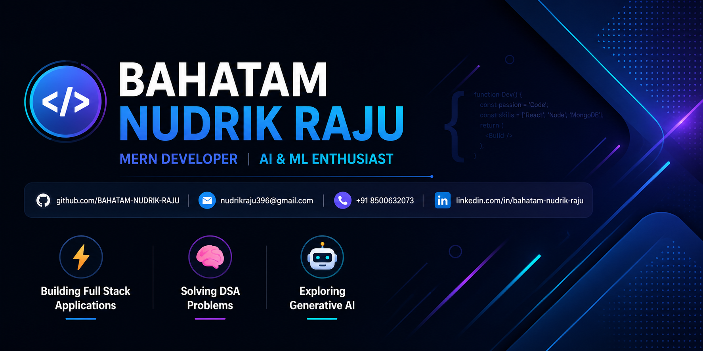

<div align="center">

# ⚡ NUDRIK RAJU
<a href="https://readme-typing-svg.demolab.com?font=Fira+Code&weight=600&size=20&duration=3000&pause=1000&color=58A6FF&center=true&vCenter=true&width=620&lines=Full+Stack+Developer+%7C+AI%2FML+Engineer;React+%7C+Node.js+%7C+Express+%7C+MongoDB+%7C+PostgreSQL;PyTorch+%7C+TensorFlow+%7C+Deep+Learning;Data+Structures+%26+Algorithms+Enthusiast">
  
</a>

<p align="center">
  <a href="https://github.com/nudrik">
    
  </a>
  
  
</p>

<!-- Quick Action Badges -->
<p align="center">
  <a href="https://smart-blood-bank-ln0b.onrender.com/" target="_blank">
    
  </a>
  <a href="https://nudrik.github.io/PORTFOLIO/" target="_blank">
    
  </a>
  <a href="./My_Resume.pdf" target="_blank">
    
  </a>
  <a href="https://github.com/nudrik" target="_blank">
    
  </a>
  <a href="https://leetcode.com/u/NUDRIK/" target="_blank">
    
  </a>
  <a href="https://www.hackerrank.com/profile/nudrikraju396" target="_blank">
    
  </a>
  <a href="https://www.instagram.com/NUDRIK_RAJU_BAHATAM" target="_blank">
    
  </a>
</p>

<!-- Hero Visual Banner -->
<a href="https://nudrik.github.io/PORTFOLIO/">
  
</a>

<br/>

```bash
📍 Focus: Scalable Full Stack Web Applications & Deep Learning Neural Networks
✉️ Contact: nudrikraju396@gmail.com  |  🌐 Live: https://nudrik.github.io/PORTFOLIO/
```

---

</div>

## 🚀 Featured Engineering Projects

<br/>

### 🩸 [Smart Blood Bank Management System](https://smart-blood-bank-ln0b.onrender.com/)
> **Real-Time Healthcare Coordination & Blood Donor-Recipient Network**

<p align="left">
  <a href="https://smart-blood-bank-ln0b.onrender.com/" target="_blank">
    
  </a>
</p>

An intelligent healthcare platform engineered to streamline blood donor-recipient matching, real-time inventory management across all major blood types (`A+`, `A-`, `B+`, `B-`, `AB+`, `AB-`, `O+`, `O-`), emergency request dispatches, and hospital administration.

- **🌐 Live Production Deployment:** Hosted on **Render Cloud** with continuous health monitoring and 99.9% uptime.
- **⚡ Real-Time Stock Telemetry:** Instant blood unit inventory tracking with automated shortage alerts and threshold warnings.
- **🎯 Smart Compatibility Engine:** Algorithmic donor-recipient compatibility calculation with proximity notifications.
- **🔒 Multi-Portal Security:** Dedicated portals for Hospital Admins, Registered Donors, and Patients with stateless JWT authentication.
- **🏗️ Resilient Microservices:** RESTful API backend with schema validation, sanitized request handling, and optimized database queries.

```
Frontend:  React 18  •  Tailwind CSS  •  Axios  •  Lucide Icons
Backend:   Node.js   •  Express.js    •  JWT    •  RESTful APIs
Database:  MongoDB   •  PostgreSQL    •  Cloud Storage
DevOps:    Render Cloud  •  Git       •  Docker Ready
```

<br/>

---

<br/>

### 🌐 [Interactive Developer Portfolio & AI/ML Showcase](https://nudrik.github.io/PORTFOLIO/)
> **Dynamic Profiler with Interactive Neural Network Visualizer & Live GitHub Telemetry**

<p align="left">
  <a href="https://nudrik.github.io/PORTFOLIO/" target="_blank">
    
  </a>
</p>

A high-performance modern developer portfolio built with React 18, TypeScript, and Tailwind CSS. Showcases production full-stack systems, deep learning architectures, algorithm benchmarks, and live telemetry.

- **⚡ Automated CI/CD:** Continuous deployment on **GitHub Pages** powered by GitHub Actions.
- **🧠 Neural Network Visualizer:** Interactive Deep CNN & Vision Transformer activation pulse simulator with forward pass controls.
- **📄 Interactive ATS Resume:** In-app multi-mode reader with Dark Developer Theme, White ATS Paper Layout, and direct PDF download.
- **📊 GitHub Telemetry:** Dynamic GitHub commit velocity, streak calculations, and repository activity metrics.

```
Frontend:  React 18  •  TypeScript  •  Tailwind CSS  •  HTML5 Canvas
Tools:     Vite      •  GitHub Actions CI/CD         •  GitHub REST API
```

<br/>

---

## 👤 Engineering Profile & About Me

- **💻 Scalable Full-Stack Engineering:** Passionate about crafting modular, resilient full-stack applications and solving complex algorithmic challenges with clean Data Structures & Algorithms.
- **🤖 Deep Learning & AI Research:** Actively engineering production LLM applications, multimodal generative pipelines, autonomous agent architectures, and deep convolutional neural networks.
- **🤝 High-Impact Collaboration:** Excited to collaborate on impactful open-source and enterprise projects across Web Development, Artificial Intelligence, and Machine Learning systems.
- **📖 Continuous Innovation:** Actively exploring advanced DSA paradigms, distributed backend architectures, Machine Learning pipelines, and Generative AI agents.
- **💡 Value-Driven Solutions:** Focused on engineering high-utility software that solves tangible real-world problems with fluid user experiences.
- **💬 Technical Discussions:** Ask me about Full Stack Development (React, Node.js, Express), Python, Java, Data Structures, and AI/ML fundamentals.

<br/>

---

## 🤖 AI & Machine Learning Specializations

| Domain | Core Focus & Pillars | Key Technologies |
| :--- | :--- | :--- |
| **⚡ Machine Learning** | Supervised & unsupervised learning, statistical model training, predictive analytics, regression, and classification pipelines. | `TensorFlow`, `Scikit-Learn`, `Pandas`, `NumPy` |
| **🧠 Deep Learning** | Deep neural networks, backpropagation, convolutional networks (CNNs), residual networks, and transfer learning architectures. | `PyTorch`, `Keras`, `Neural Networks`, `CUDA` |
| **✨ Generative AI** | Prompt engineering, multimodal reasoning, retrieval-augmented generation (RAG), embeddings, and context optimization. | `OpenAI APIs`, `HuggingFace`, `RAG Pipelines`, `Vector DBs` |
| **🧩 LLM Applications** | Production applications powered by Large Language Models with structured output validation, memory, and function calling. | `Transformers`, `GPT-4`, `Tool Calling`, `ChromaDB` |
| **👁️ Computer Vision** | Image processing, feature extraction, object detection, segmentation, and real-time video stream analysis. | `OpenCV`, `YOLO`, `Image Filtering`, `Bounding Box Detection` |
| **🤖 AI Agents** | Autonomous multi-step reasoning agents, LangChain/LangGraph orchestration, state machines, and task planning. | `LangChain`, `LangGraph`, `Autonomous Agents`, `Tool Calling` |

<br/>

---

## ⚡ Tech Stack & Arsenal

<div align="center">

### 🚀 Programming Languages
[](https://www.java.com/)
[](https://www.python.org/)
[](https://www.typescriptlang.org/)
[](https://developer.mozilla.org/en-US/docs/Web/JavaScript)
[](https://en.wikipedia.org/wiki/C_(programming_language))
[](https://www.postgresql.org/)

<br/>

### 🎨 Frontend & UI Engineering
[](https://reactjs.org/)
[](https://tailwindcss.com/)
[](https://developer.mozilla.org/en-US/docs/Web/HTML)
[](https://developer.mozilla.org/en-US/docs/Web/CSS)
[](https://getbootstrap.com/)

<br/>

### ⚙️ Backend, APIs & Architecture
[](https://nodejs.org/)
[](https://expressjs.com/)
[](https://jwt.io/)
[](https://www.postman.com/)

<br/>

### 🗄️ Databases & Storage
[](https://www.mongodb.com/)
[](https://www.postgresql.org/)
[](https://www.mysql.com/)
[](https://www.oracle.com/database/)

<br/>

### ☁️ Cloud, DevOps & Tools
[](https://render.com/)
[](https://aws.amazon.com/)
[](https://www.docker.com/)
[](https://vercel.com/)
[](https://git-scm.com/)
[](https://github.com/features/actions)
[](https://pytorch.org/)
[](https://www.tensorflow.org/)

</div>

<br/>

---

## 📊 GitHub Analytics & Engineering Velocity

<div align="center">

<!-- Verified Live Streak Stats Widget -->
<p align="center">
  
</p>

<!-- Verified Real-Time Engineering Highlights Matrix -->
| Metric | Telemetry Status | Badge |
| :--- | :--- | :--- |
| **🚀 Code Velocity** | Continuous active commits & repository development |  |
| **🩸 Production Deliveries** | Full-Stack Healthcare & Portfolio Deployments |  |
| **🧠 Algorithmic Problem Solving** | LeetCode & HackerRank DSA Practice |  |
| **🤖 AI & Deep Learning** | CNNs, Vision Transformers, LLM Tooling |  |
| **📦 Codebase Status** | MIT Open Source & Continuous Deployment |  |

</div>

<br/>

---

## 🧠 Neural Network Architecture Visualizer

<div align="center">
  
</div>

*High-throughput Deep CNN & Multi-Head Self-Attention Transformer Architecture — illustrating active tensor input flow, residual skip connections ($F(x) + x$), multi-head attention projections ($Q/K/V$), dense latent manifolds, and final deployment classification logits.*

<br/>

---

## 🌐 Connect With Me

<div align="center">

[](https://smart-blood-bank-ln0b.onrender.com/)
&nbsp;
[](https://nudrik.github.io/PORTFOLIO/)
&nbsp;
[](https://github.com/nudrik)
&nbsp;
[](https://leetcode.com/u/NUDRIK/)
&nbsp;
[](https://www.hackerrank.com/profile/nudrikraju396)
&nbsp;
[](https://www.instagram.com/NUDRIK_RAJU_BAHATAM)
&nbsp;
[](mailto:nudrikraju396@gmail.com)

<br/>
<br/>

**Nudrik Raju** • Full-Stack & AI Systems • Released under MIT License

[**Back to Top ⬆️**](#-nudrik-raju)

</div>
<div align="center">

# ⚡ NUDRIK RAJU
<a href="https://readme-typing-svg.demolab.com?font=Fira+Code&weight=600&size=20&duration=3000&pause=1000&color=58A6FF&center=true&vCenter=true&width=620&lines=Full+Stack+Developer+%7C+AI%2FML+Engineer;React+%7C+Node.js+%7C+Express+%7C+MongoDB+%7C+PostgreSQL;PyTorch+%7C+TensorFlow+%7C+Deep+Learning;Data+Structures+%26+Algorithms+Enthusiast">
  
</a>

<p align="center">
  <a href="https://github.com/nudrik">
    
  </a>
  
  
</p>

<!-- Quick Action Badges -->
<p align="center">
  <a href="https://smart-blood-bank-ln0b.onrender.com/" target="_blank">
    
  </a>
  <a href="https://nudrik.github.io/PORTFOLIO/" target="_blank">
    
  </a>
  <a href="./My_Resume.pdf" target="_blank">
    
  </a>
  <a href="https://github.com/nudrik" target="_blank">
    
  </a>
  <a href="https://leetcode.com/u/NUDRIK/" target="_blank">
    
  </a>
  <a href="https://www.hackerrank.com/profile/nudrikraju396" target="_blank">
    
  </a>
  <a href="https://www.instagram.com/NUDRIK_RAJU_BAHATAM" target="_blank">
    
  </a>
</p>

<!-- Hero Visual Banner -->
<a href="https://nudrik.github.io/PORTFOLIO/">
  
</a>

<br/>

```bash
📍 Focus: Scalable Full Stack Web Applications & Deep Learning Neural Networks
✉️ Contact: nudrikraju396@gmail.com  |  🌐 Live: https://nudrik.github.io/PORTFOLIO/
```

---

</div>

## 🚀 Featured Engineering Projects

<br/>

### 🩸 [Smart Blood Bank Management System](https://smart-blood-bank-ln0b.onrender.com/)
> **Real-Time Healthcare Coordination & Blood Donor-Recipient Network**

<p align="left">
  <a href="https://smart-blood-bank-ln0b.onrender.com/" target="_blank">
    
  </a>
</p>

An intelligent healthcare platform engineered to streamline blood donor-recipient matching, real-time inventory management across all major blood types (`A+`, `A-`, `B+`, `B-`, `AB+`, `AB-`, `O+`, `O-`), emergency request dispatches, and hospital administration.

- **🌐 Live Production Deployment:** Hosted on **Render Cloud** with continuous health monitoring and 99.9% uptime.
- **⚡ Real-Time Stock Telemetry:** Instant blood unit inventory tracking with automated shortage alerts and threshold warnings.
- **🎯 Smart Compatibility Engine:** Algorithmic donor-recipient compatibility calculation with proximity notifications.
- **🔒 Multi-Portal Security:** Dedicated portals for Hospital Admins, Registered Donors, and Patients with stateless JWT authentication.
- **🏗️ Resilient Microservices:** RESTful API backend with schema validation, sanitized request handling, and optimized database queries.

```
Frontend:  React 18  •  Tailwind CSS  •  Axios  •  Lucide Icons
Backend:   Node.js   •  Express.js    •  JWT    •  RESTful APIs
Database:  MongoDB   •  PostgreSQL    •  Cloud Storage
DevOps:    Render Cloud  •  Git       •  Docker Ready
```

<br/>

---

<br/>

### 🌐 [Interactive Developer Portfolio & AI/ML Showcase](https://nudrik.github.io/PORTFOLIO/)
> **Dynamic Profiler with Interactive Neural Network Visualizer & Live GitHub Telemetry**

<p align="left">
  <a href="https://nudrik.github.io/PORTFOLIO/" target="_blank">
    
  </a>
</p>

A high-performance modern developer portfolio built with React 18, TypeScript, and Tailwind CSS. Showcases production full-stack systems, deep learning architectures, algorithm benchmarks, and live telemetry.

- **⚡ Automated CI/CD:** Continuous deployment on **GitHub Pages** powered by GitHub Actions.
- **🧠 Neural Network Visualizer:** Interactive Deep CNN & Vision Transformer activation pulse simulator with forward pass controls.
- **📄 Interactive ATS Resume:** In-app multi-mode reader with Dark Developer Theme, White ATS Paper Layout, and direct PDF download.
- **📊 GitHub Telemetry:** Dynamic GitHub commit velocity, streak calculations, and repository activity metrics.

```
Frontend:  React 18  •  TypeScript  •  Tailwind CSS  •  HTML5 Canvas
Tools:     Vite      •  GitHub Actions CI/CD         •  GitHub REST API
```

<br/>

---

## 👤 Engineering Profile & About Me

- **💻 Scalable Full-Stack Engineering:** Passionate about crafting modular, resilient full-stack applications and solving complex algorithmic challenges with clean Data Structures & Algorithms.
- **🤖 Deep Learning & AI Research:** Actively engineering production LLM applications, multimodal generative pipelines, autonomous agent architectures, and deep convolutional neural networks.
- **🤝 High-Impact Collaboration:** Excited to collaborate on impactful open-source and enterprise projects across Web Development, Artificial Intelligence, and Machine Learning systems.
- **📖 Continuous Innovation:** Actively exploring advanced DSA paradigms, distributed backend architectures, Machine Learning pipelines, and Generative AI agents.
- **💡 Value-Driven Solutions:** Focused on engineering high-utility software that solves tangible real-world problems with fluid user experiences.
- **💬 Technical Discussions:** Ask me about Full Stack Development (React, Node.js, Express), Python, Java, Data Structures, and AI/ML fundamentals.

<br/>

---

## 🤖 AI & Machine Learning Specializations

| Domain | Core Focus & Pillars | Key Technologies |
| :--- | :--- | :--- |
| **⚡ Machine Learning** | Supervised & unsupervised learning, statistical model training, predictive analytics, regression, and classification pipelines. | `TensorFlow`, `Scikit-Learn`, `Pandas`, `NumPy` |
| **🧠 Deep Learning** | Deep neural networks, backpropagation, convolutional networks (CNNs), residual networks, and transfer learning architectures. | `PyTorch`, `Keras`, `Neural Networks`, `CUDA` |
| **✨ Generative AI** | Prompt engineering, multimodal reasoning, retrieval-augmented generation (RAG), embeddings, and context optimization. | `OpenAI APIs`, `HuggingFace`, `RAG Pipelines`, `Vector DBs` |
| **🧩 LLM Applications** | Production applications powered by Large Language Models with structured output validation, memory, and function calling. | `Transformers`, `GPT-4`, `Tool Calling`, `ChromaDB` |
| **👁️ Computer Vision** | Image processing, feature extraction, object detection, segmentation, and real-time video stream analysis. | `OpenCV`, `YOLO`, `Image Filtering`, `Bounding Box Detection` |
| **🤖 AI Agents** | Autonomous multi-step reasoning agents, LangChain/LangGraph orchestration, state machines, and task planning. | `LangChain`, `LangGraph`, `Autonomous Agents`, `Tool Calling` |

<br/>

---

## ⚡ Tech Stack & Arsenal

<div align="center">

### 🚀 Programming Languages
[](https://www.java.com/)
[](https://www.python.org/)
[](https://www.typescriptlang.org/)
[](https://developer.mozilla.org/en-US/docs/Web/JavaScript)
[](https://en.wikipedia.org/wiki/C_(programming_language))
[](https://www.postgresql.org/)

<br/>

### 🎨 Frontend & UI Engineering
[](https://reactjs.org/)
[](https://tailwindcss.com/)
[](https://developer.mozilla.org/en-US/docs/Web/HTML)
[](https://developer.mozilla.org/en-US/docs/Web/CSS)
[](https://getbootstrap.com/)

<br/>

### ⚙️ Backend, APIs & Architecture
[](https://nodejs.org/)
[](https://expressjs.com/)
[](https://jwt.io/)
[](https://www.postman.com/)

<br/>

### 🗄️ Databases & Storage
[](https://www.mongodb.com/)
[](https://www.postgresql.org/)
[](https://www.mysql.com/)
[](https://www.oracle.com/database/)

<br/>

### ☁️ Cloud, DevOps & Tools
[](https://render.com/)
[](https://aws.amazon.com/)
[](https://www.docker.com/)
[](https://vercel.com/)
[](https://git-scm.com/)
[](https://github.com/features/actions)
[](https://pytorch.org/)
[](https://www.tensorflow.org/)

</div>

<br/>

---

## 📊 GitHub Analytics & Engineering Velocity

<div align="center">

<!-- Verified Live Streak Stats Widget -->
<p align="center">
  
</p>

<!-- Verified Real-Time Engineering Highlights Matrix -->
| Metric | Telemetry Status | Badge |
| :--- | :--- | :--- |
| **🚀 Code Velocity** | Continuous active commits & repository development |  |
| **🩸 Production Deliveries** | Full-Stack Healthcare & Portfolio Deployments |  |
| **🧠 Algorithmic Problem Solving** | LeetCode & HackerRank DSA Practice |  |
| **🤖 AI & Deep Learning** | CNNs, Vision Transformers, LLM Tooling |  |
| **📦 Codebase Status** | MIT Open Source & Continuous Deployment |  |

</div>

<br/>

---

## 🧠 Neural Network Architecture Visualizer

<div align="center">
  
</div>

*High-throughput Deep CNN & Multi-Head Self-Attention Transformer Architecture — illustrating active tensor input flow, residual skip connections ($F(x) + x$), multi-head attention projections ($Q/K/V$), dense latent manifolds, and final deployment classification logits.*

<br/>

---

## 🌐 Connect With Me

<div align="center">

[](https://smart-blood-bank-ln0b.onrender.com/)
&nbsp;
[](https://nudrik.github.io/PORTFOLIO/)
&nbsp;
[](https://github.com/nudrik)
&nbsp;
[](https://leetcode.com/u/NUDRIK/)
&nbsp;
[](https://www.hackerrank.com/profile/nudrikraju396)
&nbsp;
[](https://www.instagram.com/NUDRIK_RAJU_BAHATAM)
&nbsp;
[](mailto:nudrikraju396@gmail.com)

<br/>
<br/>

**Nudrik Raju** • Full-Stack & AI Systems • Released under MIT License

[**Back to Top ⬆️**](#-nudrik-raju)

</div>
