# ⚡ NUDRIK RAJU
### **Full Stack Developer | AI/ML Engineer | DSA Enthusiast**
*Building intelligent applications with scalable code, machine learning, and modern LLM technologies.*

---

<!-- Top Navigation Bar Simulation -->

  <a href="#-featured-projects"><b>🚀 Projects</b></a> &nbsp;•&nbsp;
  <a href="#-about-me"><b>👤 About</b></a> &nbsp;•&nbsp;
  <a href="#-ai--machine-learning-specializations"><b>🤖 AI & ML</b></a> &nbsp;•&nbsp;
  <a href="#-tech-stack--arsenal"><b>⚡ Tech Stack</b></a> &nbsp;•&nbsp;
  <a href="#-github-analytics--telemetry"><b>📊 Analytics</b></a> &nbsp;•&nbsp;
  <a href="#-neural-network-architecture-visualizer"><b>🧠 Neural Graph</b></a> &nbsp;•&nbsp;
  <a href="#-connect-with-me"><b>✉️ Contact</b></a>

<!-- Hero Banner / Interactive Terminal Header -->

  

<!-- Primary Action Badges -->

  
  &nbsp;
  
  &nbsp;
  
  &nbsp;
  
  &nbsp;
  
  &nbsp;
  
  &nbsp;
  

<!-- Quick Contact & Email bar -->

  <code>✉️ Email: nudrikraju396@gmail.com</code> &nbsp;|&nbsp; <code>📍 Status: Active & Open to Opportunities</code>

  

## 🚀 Featured Projects

<table>
  <tr>
    <td width="50%" valign="top">
      

        <h3>🩸 Smart Blood Bank Management System</h3>
        
<b>Real-Time Healthcare & Blood Donor Coordination Platform</b>

        

          
        

      

      

        An intelligent full-stack healthcare application engineered to streamline donor-recipient coordination, blood bank inventory levels, emergency request dispatching, and hospital administration with high availability.
      

      <ul>
        <li><b>Live Deployment:</b> Fully hosted on <a href="https://smart-blood-bank-ln0b.onrender.com/" target="_blank">Render Cloud</a> with 99.9% uptime.</li>
        <li><b>Real-Time Inventory:</b> Real-time blood group stock tracking across multiple blood groups (A+, B+, O+, AB+, etc.).</li>
        <li><b>Smart Matching:</b> Instant donor-recipient compatibility calculation and automated emergency alert dispatches.</li>
        <li><b>Role-Based Dashboards:</b> Multi-portal authentication for Hospital Administrators, Donors, and Patients with stateless JWT authorization.</li>
        <li><b>Resilient Backend:</b> RESTful API microservice with strict data sanitization, schema validation, and optimized DB queries.</li>
      </ul>
      
<b>Tech Stack & Architecture:</b>

      

        
        
        
        
        
        
        
      

    </td>
    <td width="50%" valign="top">
      

        <h3>🌐 Interactive Developer Portfolio & AI/ML Showcase</h3>
        
<b>Dynamic Profiler with Live GitHub Telemetry & Neural Visualizer</b>

        

          
        

      

      

        A modern, dynamic developer portfolio built with React and TypeScript, showcasing production full-stack systems, deep learning architectures, algorithms benchmarks, and real-time GitHub telemetry.
      

      <ul>
        <li><b>Live Deployment:</b> Continuous deployment on <a href="https://nudrik.github.io/PORTFOLIO/" target="_blank">GitHub Pages</a> via GitHub Actions.</li>
        <li><b>Neural Network Canvas:</b> Interactive Deep CNN & Vision Transformer activation pulse simulator with forward pass controls.</li>
        <li><b>Live GitHub Telemetry:</b> Real-time commit velocity analysis, contribution streaks, repo stars, and top language telemetry.</li>
        <li><b>Interactive Resume:</b> In-app ATS resume inspector with multi-mode reader, direct PDF download, and print styles.</li>
        <li><b>Pure Dark Mode Aesthetics:</b> Engineered with mathematical typography, zero-bloat modular design, and responsive layout.</li>
      </ul>
      
<b>Tech Stack & Architecture:</b>

      

        
        
        
        
        
        
      

    </td>
  </tr>
</table>

  

## 👤 About Me

<table>
  <tr>
    <td width="60%" valign="top">
      <h3>💻 Engineering Profile</h3>
      <ul>
        <li>
          <b>🚀 Scalable Full-Stack Engineering:</b> Passionate about crafting modular, resilient full-stack applications and solving algorithmic problems through clean DSA principles.
        </li>
        <li>
          <b>🤝 High-Impact Collaboration:</b> Excited to collaborate on impactful projects across Web Development, Artificial Intelligence, and Machine Learning systems.
        </li>
        <li>
          <b>📖 Continuous Innovation:</b> Actively exploring advanced DSA paradigms, distributed backend architectures, Machine Learning pipelines, and Generative AI agents.
        </li>
        <li>
          <b>💡 Value-Driven Solutions:</b> Focused on engineering high-utility software that solves tangible real-world problems with fluid user experiences.
        </li>
        <li>
          <b>💬 Consult & Chat:</b> Ask me about Full Stack Development (React, Node.js, Express), Python, Java, Data Structures, and AI/ML fundamentals.
        </li>
        <li>
          <b>⚡ Beyond the Terminal:</b> Outside of coding, I enjoy reading technical literature, staying ahead with bleeding-edge tech trends, and self-improvement.
        </li>
      </ul>
      

        📫 <b>Direct Inquiries:</b> <a href="mailto:nudrikraju396@gmail.com">nudrikraju396@gmail.com</a>
      

    </td>
    <td width="40%" valign="top">
      

        <h3>🧠 Current Focus: GenAI & ML</h3>
        

          <em>Actively engineering production LLM applications, multimodal generative pipelines, autonomous agent architectures, and deep neural algorithms.</em>
        

        

          
            
          
        

        

        <h3>📊 Top Languages Telemetry</h3>
        
      

    </td>
  </tr>
</table>

  

## 🤖 AI & Machine Learning Specializations

  <em>Building intelligent applications with AI, Machine Learning, and modern LLM technologies across 6 core domains.</em>

<table>
  <tr>
    <td width="33%" valign="top">
      <h4>⚡ Machine Learning</h4>
      
Supervised & unsupervised learning, statistical model training, predictive analytics, and scikit-learn pipelines.

      
<b>Technologies:</b> <code>TensorFlow</code>, <code>Scikit-Learn</code>, <code>Pandas</code>, <code>NumPy</code>

      
<b>Pillars:</b> Model Evaluation, Feature Engineering, Regression & Classification

    </td>
    <td width="33%" valign="top">
      <h4>🧠 Deep Learning</h4>
      
Deep neural networks, backpropagation, convolutional networks (CNNs), and transfer learning architectures.

      
<b>Technologies:</b> <code>PyTorch</code>, <code>Keras</code>, <code>Neural Networks</code>, <code>CUDA</code>

      
<b>Pillars:</b> CNN Architectures, Optimization Algorithms, Loss Function Tuning

    </td>
    <td width="33%" valign="top">
      <h4>✨ Generative AI</h4>
      
Next-generation prompt engineering, multimodal reasoning, retrieval-augmented generation (RAG), and fine-tuning.

      
<b>Technologies:</b> <code>OpenAI APIs</code>, <code>HuggingFace</code>, <code>RAG Pipelines</code>, <code>Vector Databases</code>

      
<b>Pillars:</b> Context Engineering, Embeddings, Synthetic Data Generation

    </td>
  </tr>
  <tr>
    <td width="33%" valign="top">
      <h4>🧩 LLM Applications</h4>
      
Building production applications powered by Large Language Models with structured output validation and memory.

      
<b>Technologies:</b> <code>Transformers</code>, <code>OpenAI GPT-4</code>, <code>Function Calling</code>, <code>ChromaDB</code>

      
<b>Pillars:</b> Structured JSON Schemas, Tool Calling & Agents, Context Optimization

    </td>
    <td width="33%" valign="top">
      <h4>👁️ Computer Vision</h4>
      
Image processing, feature extraction, object detection, segmentation, and real-time video stream analysis.

      
<b>Technologies:</b> <code>OpenCV</code>, <code>YOLO</code>, <code>Image Filtering</code>, <code>Bounding Box Detection</code>

      
<b>Pillars:</b> Real-time Object Detection, Edge Detection, Image Segmentation

    </td>
    <td width="33%" valign="top">
      <h4>🤖 AI Agents</h4>
      
Autonomous multi-step reasoning agents, LangChain/LangGraph orchestration, memory management, and tool integration.

      
<b>Technologies:</b> <code>LangChain</code>, <code>LangGraph</code>, <code>Autonomous Agents</code>, <code>Tool Calling</code>

      
<b>Pillars:</b> Multi-agent Collaboration, State Machines, Task Planning & Execution

    </td>
  </tr>
</table>

  

## 🌐 Connect With Me

  
  &nbsp;
  
  &nbsp;
  
  &nbsp;
  
  &nbsp;
  
  &nbsp;
  
  &nbsp;
  

  

## ⚡ Tech Stack & Arsenal

<table>
  <tr>
    <td width="20%"><b>🚀 Languages</b></td>
    <td>
      
      
      
      
      
      
    </td>
  </tr>
  <tr>
    <td><b>🎨 Frontend</b></td>
    <td>
      
      
      
      
      
    </td>
  </tr>
  <tr>
    <td><b>⚙️ Backend</b></td>
    <td>
      
      
      
      
      
    </td>
  </tr>
  <tr>
    <td><b>🗄️ Databases</b></td>
    <td>
      
      
      
      
    </td>
  </tr>
  <tr>
    <td><b>☁️ Cloud & DevOps</b></td>
    <td>
      
      
      
      
      
      
    </td>
  </tr>
  <tr>
    <td><b>🛠️ Tools & Tools</b></td>
    <td>
      
      
      
      
      
      
      
    </td>
  </tr>
</table>

  

## 📊 GitHub Analytics & Telemetry

  
  

  

  

## 📈 Contribution Activity

  

  

## 🧠 Neural Network Architecture Visualizer

  

  <em>High-throughput Deep CNN & Multi-Head Self-Attention Transformer Architecture — illustrating active tensor input flow, residual skip connections (F(x) + x), multi-head attention projections (Q/K/V), dense latent manifolds, and final deployment classification logits.</em>

  

<!-- Footer Section -->

  

    <b>Nudrik Raju</b> &nbsp;•&nbsp; Full-Stack & AI Systems &nbsp;•&nbsp; Released under MIT License
  

  

    <a href="#-nudrik-raju"><b>Back to Top ⬆️</b></a>
  

